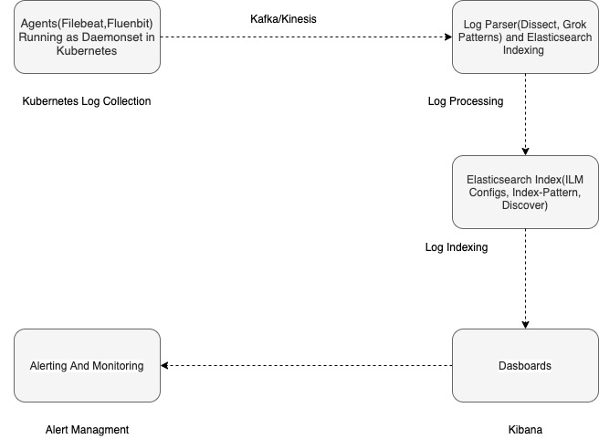

## Introduction

* Introduction to Observability
  
  - DORA's research defined these terms as follows:
    
    * Monitoring is tooling or a technical solution that allows teams to watch and understand the state of their systems. Monitoring is based on gathering predefined sets of metrics or logs.

    * Observability is tooling or a technical solution that allows teams to actively debug their system. Observability is based on exploring properties and patterns not defined in advance.

    Source: https://cloud.google.com/architecture/devops/devops-measurement-monitoring-and-observability

  - 3 Pillers of Observability - Logs, Traces, Metrics. 

* Elastic Stack [Beats, Agents, Logstash, Kinesis, Kafka, Object Storages]

## Module 1: ELK Running on Kubernetes(Elastic Cloud on Kubernetes)

- Why we need ELK for Kubernetes ? (Observability Platforms)
- Running ELK on Kubernetes(ECK).
  * Introduction to ECK Operator(OSS).
    - Refer the following:
      * https://github.com/elastic/cloud-on-k8s
      * https://www.elastic.co/guide/en/cloud-on-k8s/current/index.html
  * Elastic Stack Deployment using ECK Operator     
    - [elasticsearch.yaml](https://github.com/JESWINKNINAN/friendly-kubernetes/blob/main/ELK-For-Kubernetes(Observability)/elasticsearch/elasticsearch.yaml)
    - [kibana.yaml](https://github.com/JESWINKNINAN/friendly-kubernetes/blob/main/ELK-For-Kubernetes(Observability)/kibana/kibana.yaml)
  * Agents Stack Deployment using ECK Operator.
    - [filebeat.yaml](https://github.com/JESWINKNINAN/friendly-kubernetes/blob/main/ELK-For-Kubernetes(Observability)/agents/filebeat.yaml)
    - [metricbeat.yaml](https://github.com/JESWINKNINAN/friendly-kubernetes/blob/main/ELK-For-Kubernetes(Observability)/agents/metricbeat.yaml)
  * Kafka into Elastic Stack for optimal perfomance and staging data.
- Entire stack can be Gitops driven.  
- Optional: Monitoring Cluster For Elastic Stack     
  
## Module 2: Collecting Your First Pod Logs(Workflow)



### Log Collection

- Filebeats, Fluentbit or any ECS supported forwarders can be used to collect the Kubernetes Logs by running as daemonsets(preferred type)
- optional: Fluentbit is a Log Processor and Forwarder which allows you to collect any data like metrics and logs from different sources, enrich them with filters and send them to multiple destinations(Refer: https://github.com/fluent/fluent-bit)
- Forwarded logs will be pushed to the any of the integration as mentioned below. 

```
Filebeat -> Kafka/Kinesis -> Logstash
Filebeat -> Logstash
Fluentbit -> Kafka/Kinesis -> Logstash
Fluentbit -> Logstash
```

### Log Processing. 

- Filebeats or any agents will ships the logs to Kafka/Logstash Directly. 
- With help of log processor, we can parse and index the logs to the Elasticsearch.
- Log Processing can be done in Logstash Pipline with help of log parsers such as Dissect, Grok etc.
- [Logstash Pipeline](https://www.elastic.co/guide/en/logstash/current/pipeline.html#:~:text=The%20Logstash%20event%20processing%20pipeline,to%20use%20a%20separate%20filter)
    ```
    inputs → filters → outputs
    ```
- [Grok](https://www.elastic.co/guide/en/logstash/current/plugins-filters-grok.html#_grok_basics)
- [Dissect](https://www.elastic.co/guide/en/logstash/current/plugins-filters-dissect.html)

### Visulization

- Once the logs are getting indexed in Elasticsearch, with the help of Index-patterns and Discover we can fetch the logs as per the query.
- [Index-pattern](https://www.elastic.co/guide/en/kibana/current/index-patterns.html)
- [Discover](https://www.elastic.co/guide/en/kibana/current/discover.html) 
- [Alerting](https://www.elastic.co/what-is/kibana-alerting) 

## References
- [Monitoring vs Observability]()
- [Elastic Cloud on Kubernetes](https://github.com/elastic/cloud-on-k8s)
- [Elastic Cloud on Kubernetes-Official Docs](https://www.elastic.co/guide/en/cloud-on-k8s/current/index.html)


**More details**

- [DevOps Malayalam](https://devopsmalayalam.io)
- [CNCF Community Trivandrum](https://community.cncf.io/trivandrum/)
