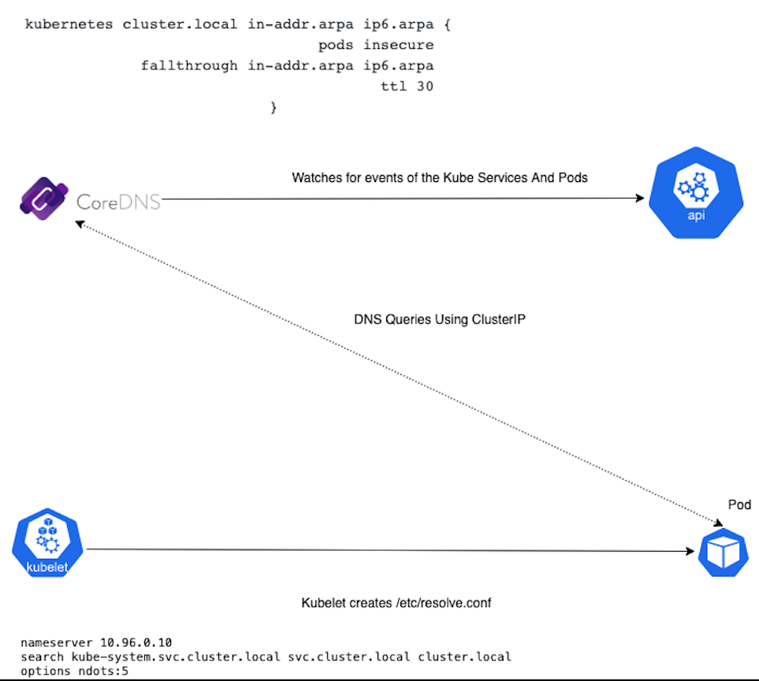

# Coredns Kubernetes
- Simple And Flexible DNS Server written in Go.
- Default add-on object for Kubernetes.
- Supports DNS, DNS over TLS (DoT), DNS over gRPC.
- Can export metrics for Prometheus(Default)
- Plug-in Architecture.

# How this DNS thing is working in kubernetes using Core-dns 

 

 - kube-dns(coredns) service watches for Kubernetes API Service And Endpoint events.
 - When an event is got triggered it is fetched by Coredns updates the DNS records as needed. 
   Note: These events are triggered when we create, update or delete Kubernetes services and their associated pods.
 - By default coredns cached(Cache Plugin) all records except zone transfers and metadata records up to 3600s which is getting feched in the above mentioned point.
 
 Note: https://kubernetes.io/docs/reference/generated/kubernetes-api/v1.21/#watch-event-v1-core

 DNS Resolution Flow
 
 - Each Pod is provisioned with /etc/resolve.conf by the respective Kubelet.
 - Resolve.conf will be having following config by default which includes the nameserver as clusterIP of the Coredns service and search options to allow for shorter hostnames to be used. 
 
 Example : 
 ```
 nameserver 10.96.0.10
 search kube-system.svc.cluster.local svc.cluster.local cluster.local 
 options ndots:5 
```

 DNS Records Formats

 Pod(A/AAA Records)
 
 Format: pod-ip-address.my-namespace.pod.cluster-domain.example
 
 Example: 172-17-0-3.default.pod.cluster.local

 Pod created by Deployments or Daemonset
 Format: pod-ip-address.deployment-name.my-namespace.svc.cluster-domain.example.

 Resolves to the Pod IP of the Service. 

 Service(A/AAA/SRV Record)

 Non-Headless

 Format: my-svc.my-namespace.svc.cluster-domain.example

 Resolves to the cluster IP of the Service.

 SRV records are created for a Kubernetes service’s named ports:

 Format: _port-name._protocol.service.namespace.svc.cluster.local

 Headless Service:

 Format: auto-generated-name.my-svc.my-namespace.svc.cluster-domain.example

# Default corefile config And References of each directives.

Default Config Corefile which came with kubernetes version 1.21.3(Kubeadm-Self Managed)
```
Corefile: |
    .:53 {
        errors
        health {
           lameduck 5s
        }
        ready
        kubernetes cluster.local in-addr.arpa ip6.arpa {
           pods insecure
           fallthrough in-addr.arpa ip6.arpa
           ttl 30
        }
        prometheus :9153
        forward . /etc/resolv.conf {
           max_concurrent 1000
        }
        cache 30
        loop
        reload
        loadbalance
    }
 ```   
Note: https://coredns.io/plugins/kubernetes/

# Best Practices 

- Maintain HA(2 replicas of core-dns deployment as min count).
- Use Cluster-Propotional Autoscaler inorder to scale the replicas with respect to the node.
- Use HPA, VPA for scaling based on the resource utilization. 
- Enable synthetic monitoring along with alerting: https://github.com/kuberhealthy/kuberhealthy
- Refer: https://github.com/coredns/deployment/blob/master/kubernetes/Scaling_CoreDNS.md

# Sources

watch: 
- https://www.youtube.com/watch?v=ZFEa2pDpvws
- https://www.youtube.com/watch?v=qRiLmLACYSY
- https://www.digitalocean.com/community/tutorials/an-introduction-to-the-kubernetes-dns-service
- https://coredns.io/2017/06/08/how-queries-are-processed-in-coredns/

Misc:

- Prometheus Metrics
```
Use the Cluster IP
curl http://10.96.0.10:9153/metrics
# HELP coredns_build_info A metric with a constant '1' value labeled by version, revision, and goversion from which CoreDNS was built.
# TYPE coredns_build_info gauge
coredns_build_info{goversion="go1.15.3",revision="054c9ae",version="1.8.0"} 1
# HELP coredns_cache_entries The number of elements in the cache.
# TYPE coredns_cache_entries gauge
coredns_cache_entries{server="dns://:53",type="denial"} 1
coredns_cache_entries{server="dns://:53",type="success"} 0
.
.
.
```
- Bypass Coredns by configuring the dnsPolicy for pod:

  Refer: https://kubernetes.io/docs/concepts/services-networking/dns-pod-service/#pod-s-dns-policy

